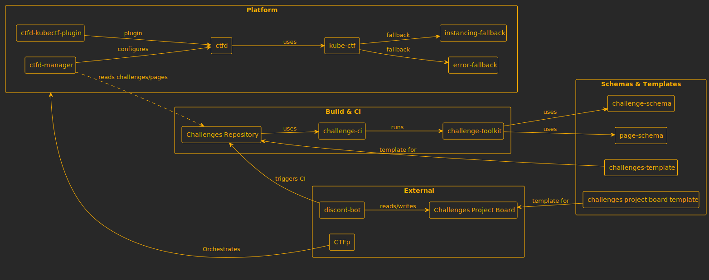

# CTF Pilot

Building fully automated CTF infrastructure

> [!TIP]
> **Looking for the CTF Platform?**  
> CTF Pilot's CTF Platform is called **[CTFp](https://github.com/ctfpilot/ctfp)**. You can find more information about CTFp in the [CTFp repository](https://github.com/ctfpilot/ctfp).
>
> **Looking for how to develop challenges for the CTF Pilot platform?**  
> You can find information about developing challenges in the **[challenge-toolkit](https://github.com/ctfpilot/challenge-toolkit)**, **[Challenge schema](https://github.com/ctfpilot/challenge-schema)**, and **[Challenges template repository](https://github.com/ctfpilot/challenges-template)**.

## Projects

CTF Pilot provides a number of projects that focus on different parts of the infrastructure.

| Project                                                                    | Description                               | Latest Release                                                                                      |
| -------------------------------------------------------------------------- | ----------------------------------------- | --------------------------------------------------------------------------------------------------- |
| **[CTFp](https://github.com/ctfpilot/ctfp)**                               | CTF Pilot's CTF Platform                  |                 |
| **[challenge-toolkit](https://github.com/ctfpilot/challenge-toolkit)**     | CTF Pilot's Challenge Toolkit             |    |
| **[challenge-ci](https://github.com/ctfpilot/challenge-ci)**               | CTF Pilot's Challenge CI                  |         |
| **[kube-ctf](https://github.com/ctfpilot/kube-ctf)**                       | Challenge manager by DownUnderCTF         |             |
| **[ctfd](https://github.com/ctfpilot/ctfd)**                               | CTF Pilot's CTFd configuration            |                 |
| **[ctfd-kubectf-plugin](https://github.com/ctfpilot/ctfd-kubectf-plugin)** | CTFd plugin for Kube-CTF                  |  |
| **[ctfd-manager](https://github.com/ctfpilot/ctfd-manager)**               | CTF Pilot's CTFd Manager                  |         |
| **[discord-bot](https://github.com/ctfpilot/discord-bot)**                 | CTF Pilot's Discord Bot                   |          |
| **[challenge-schema](https://github.com/ctfpilot/challenge-schema)**       | CTF Pilot's Challenge Schema              |     |
| **[page-schema](https://github.com/ctfpilot/page-schema)**                 | CTF Pilot's Page Schema                   |          |
| **[instancing-fallback](https://github.com/ctfpilot/instancing-fallback)** | Fallback service for challenge instancing |  |
| **[error-fallback](https://github.com/ctfpilot/error-fallback)**           | Fallback service for handling errors      |       |

To support the projects, CTF Pilot also provides the following templates:

| Project                                                                              | Description                                                                                                                                                                 |
| ------------------------------------------------------------------------------------ | --------------------------------------------------------------------------------------------------------------------------------------------------------------------------- |
| **[challenges-template](https://github.com/ctfpilot/challenges-template)**           | CTF Pilot's Challenge Repository Template.   An example is available at **[challenges-example](https://github.com/ctfpilot/challenges-example)**.                      |
| **[Challenges Project board Template](https://github.com/orgs/ctfpilot/projects/1)** | CTF Pilot's GitHub Project board template for managing challenges.   An example is available at **[Challenges example](https://github.com/orgs/ctfpilot/projects/2)**. |

### Dependencies

The following diagram roughly illustrates the dependencies between the various CTF Pilot projects:

## Architecture

The CTF Pilot infrastructure is designed around DevOps principles, utilizing GitOps workflows, Infrastructure as Code (IaC), and Continuous Integration/Continuous Deployment (CI/CD) pipelines.

The architecture is split into two main categories:

1. **CTF Platform**: This includes the core CTF Platform (CTFp) and its associated services, such as the CTFd Manager, Discord Bot, and CTFd configuration.
2. **Challenge Management**: This encompasses tools and services for challenge development, deployment, and management, including the Challenge Toolkit, Challenge CI, Kube-CTF, and related schemas.

### CTF Platform Architecture

The Platform architecture diagram illustrates how CTFp orchestrates the various components into the collected platform, which runs in Kubernetes.

To learn more about the CTF Platform architecture, please visit the [CTFp repository](https://github.com/ctfpilot/ctfp?tab=readme-ov-file#architecture).

### Challenge Management Architecture

The Challenge Management architecture diagram illustrates how challenges are managed, continuously configured and deployed within the CTF Pilot infrastructure.

You can learn more about the challenge architecture in the [CTFp repository](https://github.com/ctfpilot/ctfp?tab=readme-ov-file#challenge-deployment), [CTF Pilot's Challenge Toolkit](https://github.com/ctfpilot/challenge-toolkit), and [CTF Pilot's Challenges Template](https://github.com/ctfpilot/challenges-template). An example challenges repository can be found at [CTF Pilot's Challenges example repository](https://github.com/ctfpilot/challenges-example).

## Contribution

We welcome contributions of all kinds—from **code** and **documentation** to **bug reports** and **feedback**!

CTF Pilot includes both open-source and dual-licensed projects. To maintain the ability to distribute contributions across all our licensing models, **all code contributions require signing a Contributor License Agreement (CLA)**.

Please check the [Contribution Guidelines (`CONTRIBUTING.md`)](/CONTRIBUTING.md) within the specific project repository you are working on for detailed guidelines. You can review **[the CLA here](https://github.com/ctfpilot/cla)**. CLA signing happens automatically when you create your first contribution.

### Project management

In order to keep track of contributions, we use **GitHub Projects** for project management.  
One project board is created for the whole CTF Pilot project, which includes all repositories.

This can be found at **[CTF Pilot Project Board](https://github.com/orgs/ctfpilot/projects/3)**.  
The project board is the north star for the project, leading what should be worked on next.

To shortly summarize the status columns:

- **Specification**: New ideas and proposals that are being specified.
- **Backlog**: Approved tasks that have been specified but might need a bit more planning and refinement.
- **Ready**: Tasks that are ready to be picked up by contributors.
- **In Progress**: Tasks that are currently being worked on.
- **In Review**: Tasks that are completed and are awaiting review.
- **Done**: Completed tasks that have been merged and deployed.

## Code of Conduct

We expect all contributors to adhere to our [Code of Conduct](/CODE_OF_CONDUCT.md) to ensure a welcoming and inclusive environment for all.

## Background

CTF Pilot started as a CTF Platform project, originating in **[Brunnerne](https://github.com/brunnerne)**.

CTF Pilot is owned and maintained by **[The0Mikkel](https://github.com/The0mikkel)**.
